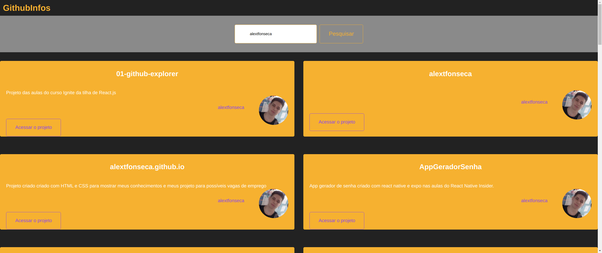

# GithubInfos



> Minha primeira aplicação em React.js, esse projeto utiliza a API do github para pesquisar todos os repositórios de qualquer usuário.

## 💻 Pré-requisitos

Antes de começar, verifique se você atendeu aos seguintes requisitos:

- Você instalou a versão mais recente do `< node / npm ou yarn >`
- Você tem uma máquina `< Windows / Linux / Mac >`.

## 🚀 Instalando o projeto na sua maquina

Para instalar o projeto, siga estas etapas:

Linux e macOS:

```bash
git clone https://github.com/alextfonseca/githubInfos.git

$ cd githubInfos

$ yarn install ou npm install

$ yarn start ou npm start
```

Windows:

```bash
git clone https://github.com/alextfonseca/githubInfos.git

$ cd githubInfos

$ yarn install ou npm install

$ yarn start ou npm start
```

## 🧾 Usando o projeto

Com o projeto GithubInfos você pode pesquisar todos os projetos de qualquer usuário do github usando seu nome de usuário:

# <a href="http://github-infos.vercel.app">Acesse o projeto</a>

## 🧑‍💻 Criador

<table>
  <tr>
    <td align="center">
      <a href="https://github.com/alextfonseca">
        <br>
        <sub>
          <b>Alex Teixeira da Fonseca</b>
        </sub>
      </a>
    </td>
  </tr>
</table>

## 😄 Me siga nas redes sociais<br>

<p align="left">

  <a href="https://www.linkedin.com/in/alex-teixeira-da-fonseca-5a99931a2/" alt="Linkedin">
  </a>

  <a href="https://wa.me/+5511976184659?text=Olá%20Alex" alt="WhatsApp">
  </a>

  <a href="https://www.instagram.com/devalextf/?hl=pt-br" alt="Instagram">
  </a>
</p>
